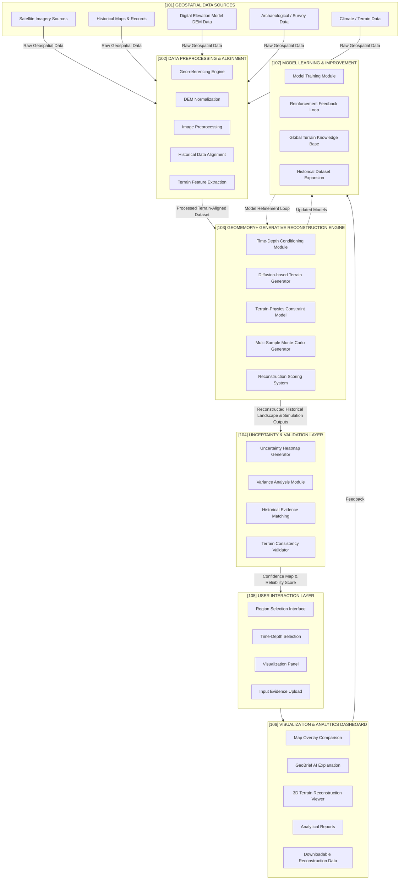

# 🏛️ Patent Documentation: GeoMemory+ (Generative AI System for Terrain-Constrained Historical Geography)

> 🔒 **Intellectual Property Notice:**  
> This repository documents the architecture, mathematical conditioning, and theoretical claims of the patent filed for **GeoMemory+**. Source code and proprietary model weights are protected under intellectual property laws. High-level architecture flowcharts, mathematical formulations, and system specifications are documented below for academic review and graduate admissions evaluation.

---

## 📌 Patent Summary & Metadata

- **Invention Title:** Generative Artificial Intelligence System for Terrain-Constrained Reconstruction of Historical Geography (`GeoMemory+`)
- **Inventors:** **Sampathkumar N**, Duranjai V, Mr. Ilamurugan G
- **Primary Domain:** AI & Geospatial Machine Learning, Diffusion Models, Remote Sensing, Digital Elevation Modeling (DEM), Hydrological Conditioning
- **Target Applications:** Climate change impact assessment, historical landscape evolution, disaster risk assessment, urban planning & paleogeography.

---

## 🏛️ Official GeoMemory+ System Architecture (Fig .1)



---

## 📑 Claims & Technical Novelty

1. **Multi-Source Geospatial Fusion Layer (101 & 102):** Merges satellite remote sensing imagery, DEM elevation models, historical maps, and survey records.
2. **Terrain-Physics Constrained Generative Synthesis (103):** Integrates time-depth conditioning and physical terrain constraints into diffusion sampling and Monte-Carlo generation.
3. **Uncertainty & Consistency Validation (104):** Computes pixel-wise spatial uncertainty heatmaps and validates terrain consistency via multi-sample variance analysis.
4. **Interactive Analytics & Continuous Learning (105, 106 & 107):** Features 3D terrain viewers, GeoBrief AI explanations, downloadable datasets, and reinforcement feedback loops.

---

## 📖 Academic Citation

```bibtex
@patent{kumar2026geomemory,
  author    = {Sampathkumar, N. and Duranjai, V. and Ilamurugan, G.},
  title     = {Generative Artificial Intelligence System for Terrain-Constrained Reconstruction of Historical Geography},
  year      = {2026},
  note      = {Patent Filed. System Architecture: GeoMemory+ (Fig .1)},
  publisher = {Intellectual Property Office}
}
```

---

<div align="center">

**Documented for US Graduate Admissions & Academic Faculty Review**  
*Sampathkumar N | B.E. Computer Science & Engineering (AI & ML) '27*

</div>
