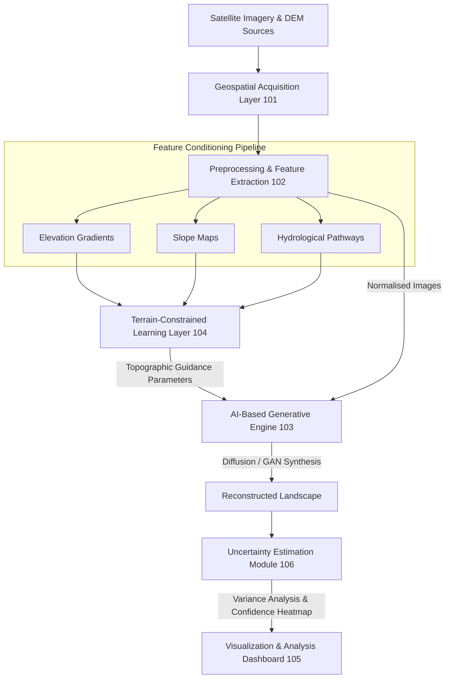

# 🏛️ Patent Documentation: GeoMemory+ (Generative AI System for Terrain-Constrained Historical Geography)

> 🔒 **Intellectual Property Notice:**  
> This repository documents the architecture, mathematical conditioning, and theoretical claims of the patent filed for **GeoMemory+**. Source code and proprietary model weights are protected under intellectual property laws. High-level architecture flowcharts, mathematical formulations, and system specifications are documented below for academic review and graduate admissions evaluation.

---

## 📌 Patent Summary & Metadata

- **Invention Title:** Generative Artificial Intelligence System for Terrain-Constrained Reconstruction of Historical Geography (`GeoMemory+`)
- **Inventors:** **Sampath Kumar**, et al.
- **Primary Domain:** AI & Geospatial Machine Learning, Diffusion Models, Remote Sensing, Digital Elevation Modeling (DEM), Hydrological Conditioning
- **Target Applications:** Climate change impact assessment, historical landscape evolution, disaster risk assessment, urban planning & paleogeography.

---

## 💡 Abstract & Core Innovation

Conventional geographic reconstruction relies on manual GIS analysis or unconstrained generative models that synthesize visually realistic landscapes but lack **topographic continuity and physical plausibility**.

**GeoMemory+** introduces a multi-stage **terrain-constrained generative AI architecture** (incorporating Diffusion Models / GANs) that ingests satellite imagery and Digital Elevation Models (DEM) to synthesize historical or altered landscapes (river migration, coastal erosion, past vegetation zones). 

The system incorporates:
1. **Terrain-Aware Learning Constraints:** Conditioned on slope gradients, watershed flow directions, and topographic elevation continuity to prevent physically impossible geography.
2. **Uncertainty Estimation Mechanism:** Evaluates pixel-level confidence across generated landscape samples by calculating variance across multiple stochastic passes.

---

## 🏛️ System Architecture (`GeoMemory+`)



---

## 📑 Claims & Technical Novelty

1. **Terrain-Constrained Conditioning (Claim 1 & 4):** Utilizes slope continuity, watershed flow directions, and topographic elevation patterns as conditioning loss vectors during generative diffusion sampling.
2. **Spatial Uncertainty Quantifier (Claim 5):** Computes pixel-wise spatial confidence metrics by analyzing variance across multiple stochastic sampling iterations.
3. **Multi-Scale Hydrological Realism (Claim 9):** Automatically infers historical river courses, coastline retreat, and vegetation shifts without requiring manual physical simulations.

---

## 📖 Academic Citation

```bibtex
@patent{kumar2026geomemory,
  author = {Kumar, Sampath and Co-inventors},
  title = {Generative Artificial Intelligence System for Terrain-Constrained Reconstruction of Historical Geography},
  year = {2026},
  holder = {Sampath Kumar},
  note = {Patent Document: GeoMemory+ System}
}
```

---

<div align="center">

**Documented for US Graduate Admissions & Academic Faculty Review**  
*Sampath Kumar | B.E. Computer Science & Engineering (AI & ML) '27*

</div>
