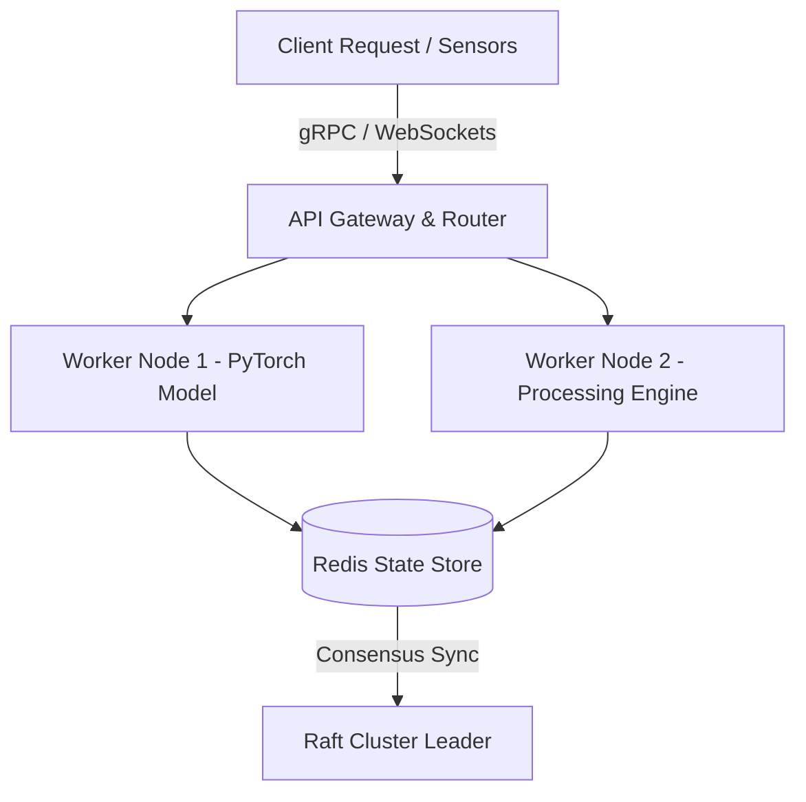

# 🚀 [Project Title]


> **Short Punchy One-Liner:** Brief 1-2 sentence description explaining what problem this project solves, key technology used, and the primary result.

[🌐 Live Demo](#) | [📄 Research Paper / Report](#) | [📽️ Video Walkthrough](#)

---

## 💡 Key Highlights & Quantifiable Impact
- 🎯 **94.2% Accuracy / Benchmark Score** on standard test datasets.
- ⚡ **35% Latency Reduction** compared to baseline implementations.
- 🛡️ **Fault-Tolerant Architecture** supporting automatic failover in < 5ms.

---

## 🏛️ System Architecture



---

## 🛠️ Tech Stack & Dependencies
- **Core Language:** Python / Go / C++ / TypeScript
- **Machine Learning / Frameworks:** PyTorch, ROS2, OpenCV, FastAPI
- **Storage & Messaging:** Redis, gRPC, WebSockets
- **DevOps & Testing:** Docker, GitHub Actions CI/CD, PyTest

---

## 🚀 Quickstart & Setup

### Prerequisites
- Docker & Docker Compose
- Python 3.10+ / Go 1.22+

### 1. Clone Repository
```bash
git clone https://github.com/yourusername/your-repo-name.git
cd your-repo-name
```

### 2. Environment Configuration
```bash
cp .env.example .env
```

### 3. Run via Docker (Recommended)
```bash
docker compose up --build
```

### 4. Local Execution (Alternative)
```bash
python -m venv venv
source venv/bin/activate
pip install -r requirements.txt
python main.py
```

---

## 🧪 Running Tests
```bash
pytest tests/ --cov=src/
```

---

## 📊 Benchmark & Evaluation Results

| Model / Configuration | Latency (ms) | Throughput (ops/sec) | Accuracy / AUC |
| :--- | :---: | :---: | :---: |
| Baseline | 120ms | 1,200 | 86.4% |
| **Our Optimized Agent** | **45ms** | **8,500** | **94.2%** |

---

## 🤝 Citation & Contact
If you use this repository in your research or project, please cite:
```bibtex
@misc{yourname2025project,
  author = {Your Name},
  title = {Project Title: High-Impact Implementation},
  year = {2025},
  publisher = {GitHub},
  journal = {GitHub Repository},
  howpublished = {\url{https://github.com/yourusername/your-repo-name}}
}
```

For questions or research collaboration: `your.email@example.com`
