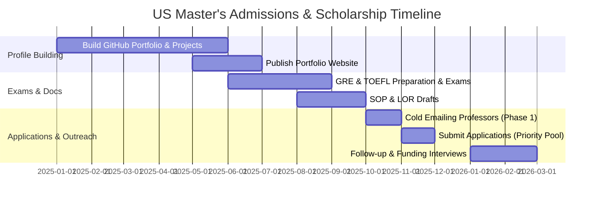

# 🎓 Comprehensive Blueprint: US Master's Admissions & Scholarship Strategy

Securing admission into top US universities with **full or partial funding** (tuition waivers + monthly stipends) requires a clear strategic approach.

This guide provides an end-to-end framework covering **Funding Types**, **University Selection Strategy**, **Cold Emailing Professors for RA/TA**, **SOP/LOR Framing**, and **Application Timelines**.

---

## 💰 1. Understanding US University Funding & Scholarship Types

Graduate funding in the US falls into four primary categories:

### A. Graduate Research Assistantship (RA) — *Best for Project/Research Heavy Profiles*
- **What it covers:** 100% Tuition Waiver + Monthly Living Stipend ($1,800 – $3,200/month) + Health Insurance.
- **Who pays:** Funded directly by a professor's research grant (NSF, DARPA, NIH, Industry grants).
- **How to get it:** Cold-emailing professors whose research matches your GitHub projects / publications.

### B. Graduate Teaching Assistantship (TA) — *Best for Strong Fundamentals & Good Communication*
- **What it covers:** 50% – 100% Tuition Waiver + Monthly Living Stipend ($1,500 – $2,800/month).
- **Who pays:** The University Department.
- **How to get it:** High TOEFL/IELTS speaking score (typically 26+ speaking TOEFL or 8.0+ IELTS), high grades in undergraduate core subjects (Data Structures, Algorithms, OS, Networking).

### C. Departmental Merit Scholarships
- **What it covers:** Partial tuition grants ($5,000 to $25,000 per year) awarded automatically upon admission.
- **How to get it:** Applying **BEFORE priority deadlines** (typically Dec 1 or Dec 15 for Fall).

### D. External Fellowships & Grants
- Fulbright-Nehru Master's Fellowships, JN Tata Endowment, Inlaks Shivdasani Foundation, KC Mahindra Scholarships.

---

## 🏛️ 2. Strategic University Tiering & Selection Matrix

When selecting 8 to 10 universities, balance your list using this distribution:

| Tier | Category | Description | Example Universities (CS/STEM) | Funding Probability |
| :--- | :--- | :--- | :--- | :--- |
| **Tier 1** | **Ambitious (Dream)** | Top 15-30 Global CS Programs. Extremely competitive. | UT Austin, UIUC, Purdue, UW Madison, UCSD | High RA/TA availability, but fierce competition |
| **Tier 2** | **Target (High Fit)** | Top 30-70 Programs with strong lab funding & mid-range fees. | Stony Brook, TAMU, ASU, NC State, Virginia Tech, Penn State, UF | **Highest RA/TA success rate** for strong profiles |
| **Tier 3** | **Safe (Funding Heavy)** | Regional research powerhouses offering guaranteed TA/scholarships. | UT Dallas, UIC, UMass Amherst, UNCC, USF, Iowa State | High probability of merit scholarships or TA by Semester 2 |

> [!TIP]
> **Pro Tip:** Look for MS programs with a thesis track (**MS with Thesis**). Thesis track students are given priority for Research Assistantships over course-only MS students!

---

## 📧 3. The Cold Emailing Playbook (Securing Research Assistantships)

Cold emailing professors is the **#1 proven method** to secure an RA before or immediately after arriving on campus.

### When to Email:
- **Phase 1 (Pre-Application):** October – November (Inquire if they are accepting MS students into their lab for the upcoming term).
- **Phase 2 (Post-Submission):** January – February (Inform them you've applied and link your updated GitHub code).

### Winning Cold Email Template (150 Words Max):

```text
Subject: Prospective MS Student Inquiry – Research Alignment in [Lab Name / Field]

Dear Professor [Professor's Last Name],

I hope this email finds you well. I am an incoming Master's applicant in Computer Science for Fall 2026, with a strong background in [Your Field, e.g., Distributed Systems and Reinforcement Learning].

I recently read your paper on "[Insert Title of Professor's Recent 2024/2025 Paper]" and was particularly fascinated by how you resolved [Specific Technique/Problem from Paper]. 

In my recent project, [Project Name - hyperlinked to GitHub], I engineered a [1-sentence summary of your project, e.g., Raft-based distributed scheduler in Go that achieved 10k ops/sec]. Given the overlap with your lab's focus on scalable systems, I am eager to contribute to your ongoing research as a Graduate Research Assistant.

My portfolio website ([yourportfolio.com]) and CV are attached for your review. Would you have 10 minutes for a brief call next week to discuss potential opportunities in your lab?

Thank you for your time and consideration.

Best regards,

[Your Name]
B.Tech in Computer Science & Engineering
GitHub: github.com/yourusername | Portfolio: yourportfolio.com
Phone: +91 XXXXX XXXXX
```

### Key Rules for Cold Emailing:
1. **Never send generic mass emails.** Always reference a specific paper published by the lab in the last 18 months.
2. **Always link a working GitHub repo or live demo** that proves you possess the exact tech stack required for their lab.
3. **Follow up once** after 7–10 days if no response.

---

## 📝 4. Statement of Purpose (SOP) & LOR Alignment Strategy

### SOP Structure for Master's Applicants:
- **Paragraph 1: Introduction & Research Hook (150 words)** – State your specific academic interest and career trajectory.
- **Paragraph 2: Academic & Technical Foundation (250 words)** – Highlight key coursework and top 2 projects (mention metrics, tech stack, and engineering challenges solved).
- **Paragraph 3: Research & Work Experience (200 words)** – Detail internships, research fellowships, or hackathon wins.
- **Paragraph 4: Why THIS University & Lab Fit (200 words)** – Name 2 specific professors, their labs, and exact projects you want to contribute to.
- **Paragraph 5: Long-term Career Goals (100 words)** – Describe how the MS degree aligns with your goal (e.g., PhD, Industrial R&D Engineer).

---

## 📅 5. Admissions Timeline (12-Month Action Plan)


