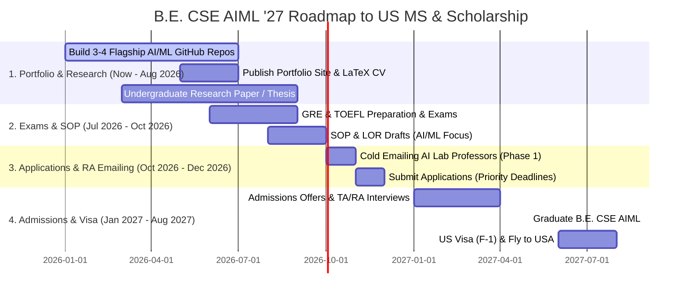

# 🎓 Master Roadmap for B.E. CSE (AI & ML) - Class of 2027
## How to Secure Top US Universities with Scholarships & RA/TA Funding

As a **B.E. Computer Science & Engineering (AI & ML)** student graduating in **May 2027**, you have a **huge tactical advantage**: time! 

Because AI & Machine Learning is currently the most heavily funded domain in US universities (via NSF grants, DARPA, NVIDIA, and industry labs), professors are actively looking for incoming Master's students with solid **PyTorch/C++ coding skills, clean GitHub projects, and reproducible ML benchmarks**.

---

## 📅 Your Strategic Master Timeline (2026 ➔ 2027)



---

## 🔬 1. The 4 Flagship AI/ML Projects to Build on GitHub Before Oct 2026

To get a professor's attention for a **Research Assistantship (RA)** that pays 100% tuition + stipend, your GitHub profile should feature projects in these core AI/ML subfields:

1. **Project 1 (Deep Learning / Foundation Models):**  
   - *Example:* LLM Multi-Agent System or Quantized Local LLM (Llama 3 / Mistral) with RAG & Vector Search.
   - *Tools:* PyTorch, LangChain, FAISS, vLLM.

2. **Project 2 (Computer Vision):**  
   - *Example:* Vision Transformer (ViT) or YOLOv8/v9 custom architecture for medical or autonomous vehicle perception with Grad-CAM feature visualization.
   - *Tools:* PyTorch, OpenCV, TensorRT.

3. **Project 3 (Reinforcement Learning or Robotics):**  
   - *Example:* Soft Actor-Critic (SAC) or PPO obstacle avoidance agent in Gazebo / Isaac Sim.
   - *Tools:* PyTorch, ROS2, Isaac Gym.

4. **Project 4 (MLOps & C++/CUDA Optimization):**  
   - *Example:* Custom CUDA kernel for attention acceleration or FastAPI inference server with Docker & Kubernetes.
   - *Tools:* C++, CUDA, Triton, Docker, FastAPI.

---

## 🏛️ 2. Top US Universities for MS in AI / CS with Strong Funding

Target a strategic mix of 8–10 universities:

### Tier 1: Ambitious / Dream (Heavy Research Grants)
- **UIUC (University of Illinois Urbana-Champaign)** – MS in CS
- **UT Austin** – MS in CS (Option in AI)
- **Purdue University** – MS in CS
- **UW Madison** – MS in CS (Research Track)
- **UCSD** – MS in CS (AI Specialization)

### Tier 2: Target (High RA/TA Funding Success Rate for AIML Students)
- **Stony Brook University (SUNY)** – High TA availability for CS/AI
- **Texas A&M University (TAMU)** – Massive research budget
- **Arizona State University (ASU)** – High departmental merit scholarships
- **NC State University (NCSU)** – Strong AI/Robotics labs
- **Virginia Tech** – MS CS (Thesis option has full funding preference)

### Tier 3: High Scholarship / Safe
- **UT Dallas (UTD)** – Generous AES merit scholarships & TA in 2nd semester
- **University of Illinois Chicago (UIC)** – Strong CS funding pool
- **UMass Amherst** – Renowned AI faculty (CLESS/IESL labs)

---

## 📧 3. Cold Emailing AI Professors (Exact Template for AIML Students)

Proactive outreach in **October/November 2026** can secure an RA offer before you even land in the US!

```text
Subject: Prospective MS Student Inquiry (Fall 2027) – Research in [Professor's Subfield, e.g., Vision-Language Models]

Dear Professor [Professor's Last Name],

I hope this email finds you well. I am a final-year B.E. student in Computer Science & Engineering (AI & ML) at [Your College Name], graduating in May 2027, and applying for the MS in [AI/CS] for Fall 2027.

I recently read your paper on "[Insert Title of Professor's 2025/2026 Paper]" and was particularly inspired by your approach to [Specific Method/Experiment from Paper]. 

During my undergraduate work, I developed [Project Name - Hyperlink to GitHub], where I implemented [1 sentence describing your PyTorch/C++ architecture and benchmark result, e.g., a Vision Transformer achieving 0.91 AUC on 100k X-rays]. Given your lab's focus on scalable multimodal AI, I am eager to contribute to your ongoing research as a Graduate Research Assistant.

My portfolio ([yourportfolio.com]) and CV are attached. Would you be open to a brief 10-minute call next week to discuss potential opportunities in your lab?

Thank you for your time and guidance.

Best regards,

Sampath Kumar
B.E. CSE (AI & ML) | Class of 2027
GitHub: github.com/yourusername | Portfolio: yourportfolio.com
```

---

## 🎯 4. Next Immediate Actions (No Rush, Step-by-Step!)

1. **Step 1:** Use your time to build 1 great project at a time. Put all code on GitHub using the [PROJECT_README_TEMPLATE.md](file:///Users/sampathkumar/Documents/Higher%20Studies/PROJECT_README_TEMPLATE.md).
2. **Step 2:** Maintain a high CGPA in your remaining semesters (aim for 8.5+ / 10).
3. **Step 3:** Update your portfolio site ([index.html](file:///Users/sampathkumar/Documents/Higher%20Studies/index.html)) whenever you complete a new project or win a hackathon.
4. **Step 4:** Plan GRE/TOEFL for mid-2026 so you have stress-free applications in late 2026!
